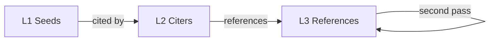

# README Restyle Options

## Current Pain Points

- **Online Ingestion Notes** is a ~30-item flat bullet list mixing CLI flags, architecture, checkpoint internals, and testing details.
- **Config reference** is another long bullet wall.
- No visual hierarchy or TOC for a 370-line doc.

---

## Option A: Grouped sections with collapsible details

**Style**: Break flat bullet lists into titled subsections. Tuck deep-dive content (checkpoint phases, staleness semantics, canary config) inside `<details>` blocks.

**Example repos**:
- [astral-sh/ruff](https://github.com/astral-sh/ruff) — short intro, grouped subsections with expandable config details
- [tiangolo/fastapi](https://github.com/tiangolo/fastapi) — layered sections, core concepts first, details later

**Before → After sketch** (Online Ingestion Notes):

```md
### Online Ingestion

#### Providers
Supported v1 providers: `openalex`, `semantic_scholar`, `crossref`, `core`. ...

#### Graph Depth
| Depth   | Behaviour |
|---------|-----------|
| `l2`    | Direct citers of L1 seeds |
| `l2l3`  | L2 + L3 references + L3→L3 second pass |

#### Checkpoint & Resume
<details>
<summary>Phase details (click to expand)</summary>
- Phase 1: provider-level completion ...
- Phase 2: L2 mid-pagination resume ...
- Phase 3.1: L3 resume for all providers ...
- Second pass: L3→L3 edge discovery ...
</details>
```

**Pros**: Lowest effort; keeps all info but hides complexity. Works well in GitHub rendering.
**Cons**: `<details>` blocks don't render in all Markdown viewers (e.g., PyPI, some IDEs).

---

## Option B: Tables for structured data, prose for concepts

**Style**: Convert the Config reference and metadata counters into tables. Use short prose paragraphs (not bullets) for conceptual explanations. Add a TOC at the top.

**Example repos**:
- [httpie/cli](https://github.com/httpie/cli) — tables for options, clean prose sections
- [encode/httpx](https://github.com/encode/httpx) — table-driven API reference, narrative intro

**Before → After sketch** (Config reference):

```md
## Configuration

| Key | Type | Default | Description |
|-----|------|---------|-------------|
| `theory_name` | string | *required* | Human-readable theory name. CLI: `--theory-name` |
| `depth` | string | `l2l3` | `l2` or `l2l3` |
| `max_l3` | int \| null | null | Per-provider L3 cap (first + second pass) |
| ... | | | |
```

**Checkpoint stats → table**:

```md
| Counter | Description |
|---------|-------------|
| `l3_to_l3_edges_added` | L3→L3 edges retained after second-pass filtering |
| `l3_to_l3_parent_scanned_count` | L3 parents scanned for outgoing refs |
| `l3_to_l3_resumed_providers` | Providers resumed from L3→L3 checkpoint |
```

**Pros**: Scannable, professional, universally rendered. Great for reference material.
**Cons**: Tables get unwieldy if descriptions are long; harder to edit in raw Markdown.

---

## Option C: Conceptual narrative + separate reference docs

**Style**: README becomes a short conceptual overview with a "Getting Started" flow. Move the Config reference, metadata schema, and checkpoint internals into a `docs/` folder. Link from README.

**Example repos**:
- [langchain-ai/langchain](https://github.com/langchain-ai/langchain) — short README that links to full docs site
- [pydantic/pydantic](https://github.com/pydantic/pydantic) — brief README, everything else in docs/

**Structure**:

```
README.md              ← Overview, install, quickstart (< 100 lines)
docs/
  configuration.md     ← Config reference table
  ingestion.md         ← Online ingestion architecture, providers, depth, phases
  checkpoint.md        ← Checkpoint/resume internals, staleness, metadata counters
  data-formats.md      ← citation_data.json, papers_data.json schemas
```

**Pros**: README stays welcoming; deep docs live where they can grow. Scales well.
**Cons**: More files to maintain; readers have to click through. No docs site rendering unless you add MkDocs/Sphinx.

---

## Option D: Visual-first with architecture diagram

**Style**: Lead with a Mermaid diagram showing L1→L2→L3→L3 flow. Use a badge bar, short intro, then grouped sections with tables (combines A + B). The visual anchor makes the graph concepts immediately clear.

**Example repos**:
- [mermaid-js/mermaid](https://github.com/mermaid-js/mermaid) — diagram-driven README
- [excalidraw/excalidraw](https://github.com/excalidraw/excalidraw) — visual-first, minimal text

**Example diagram**:



**Pros**: Makes the multi-level graph instantly understandable; Mermaid renders natively on GitHub.
**Cons**: Doesn't fix the wall-of-text Config section on its own — best combined with A or B.

---

## Recommendation

**B + D** (tables + Mermaid diagram) gives the highest readability lift for the least structural disruption — no new files, everything stays in one README, but the flat bullet lists become scannable tables and the graph concept gets a visual anchor.
